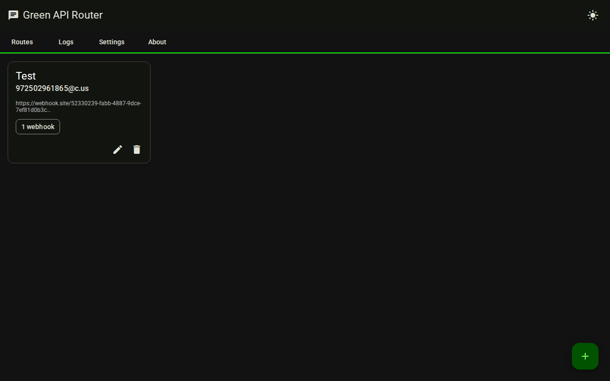
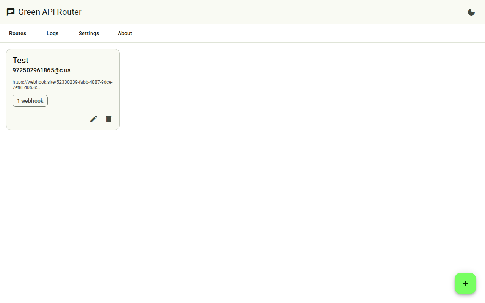
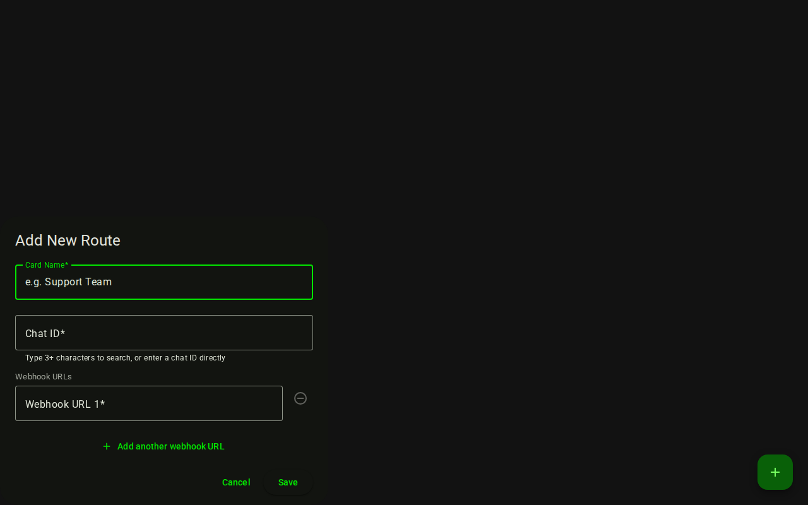
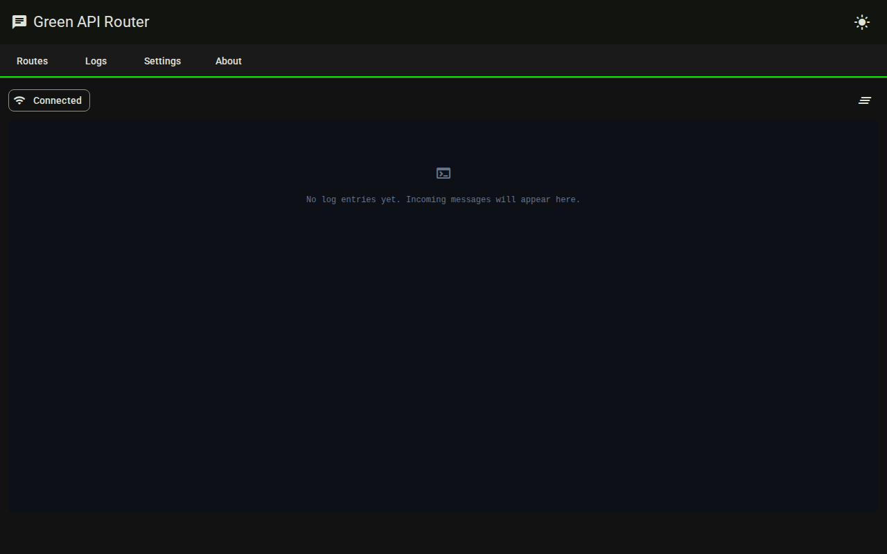
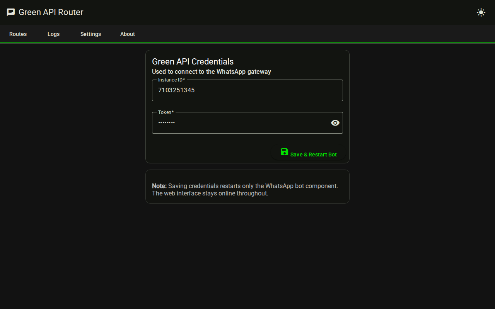
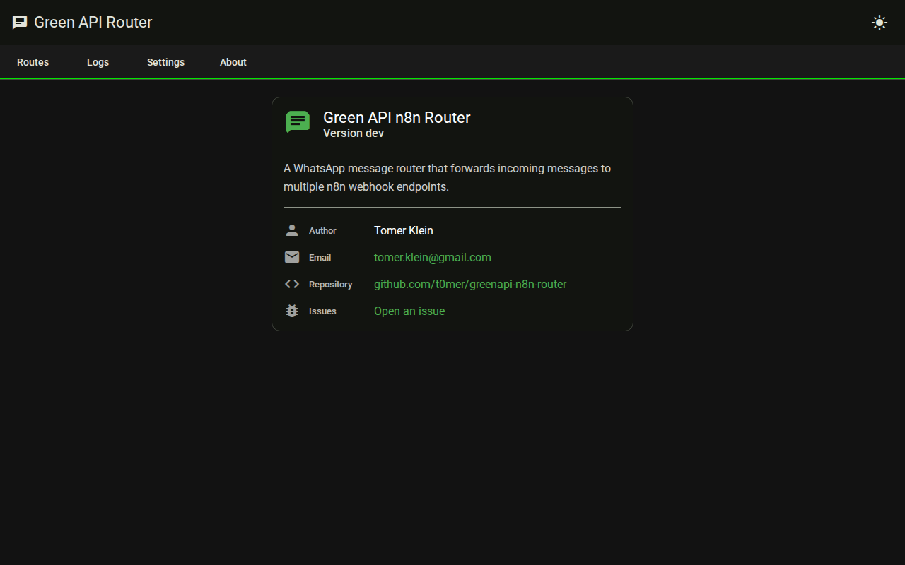
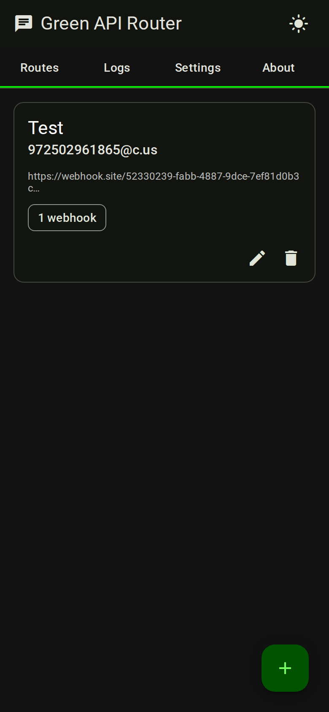

# Green API n8n Router

A WhatsApp message router that forwards incoming messages to multiple n8n webhook endpoints, with a modern Angular web management interface.


---

## Screenshots

### Routes — Dark Mode


### Routes — Light Mode


### Add Route Dialog


### Logs Tab


### Settings Tab


### About Tab


### Mobile


---

## Features

- **Route management** — map WhatsApp chat IDs to one or more n8n webhook URLs
- **Contact search** — autocomplete from your Green API contacts when adding routes
- **Real-time logs** — live WebSocket log viewer showing message forwarding activity
- **Bot-only restart** — apply new credentials without taking the web interface down
- **Dark / light theme** — system-preference-aware toggle persisted to localStorage
- **Responsive** — works on desktop, tablet, and mobile

---

## Quick Start

### Docker Compose (recommended)

```yaml
services:
  greenapi-n8n-router:
    image: techblog/greenapi-n8n-router
    container_name: greenapi-n8n-router
    volumes:
      - ./config:/app/config
    ports:
      - "8000:8000"
    restart: unless-stopped
```

```bash
docker-compose up -d
```

Open `http://localhost:8000`, go to **Settings**, enter your Green API Instance ID and Token, and save.

### Native

```bash
git clone https://github.com/t0mer/greenapi-n8n-router.git
cd greenapi-n8n-router

pip install -r requirements.txt
cd app && python app.py
```

---

## Configuration

Green API credentials and routes are managed through the web UI. They are stored in `config/config.yaml` (mounted as a Docker volume so they survive restarts).

```yaml
green_api:
  instance_id: "7103251347"
  token: "your-token-here"
  api_url: ""           # leave blank for default; set your cluster URL if needed

routes:
  972501234567@c.us:
    name: "Support Team"
    target_urls:
      - https://n8n.example.com/webhook/support
      - https://n8n.example.com/webhook/backup
  120363025623@g.us:
    name: "Group Chat"
    target_urls:
      - https://n8n.example.com/webhook/group
```

> **Upgrading from an older version?** If a `config.yaml` already exists, the app will automatically migrate your routes and credentials to the database on first start and show a banner in the UI.

---

## API Reference

All endpoints are under `/api/v1`. Interactive docs at `http://localhost:8000/api/docs`.

| Method | Path | Description |
|--------|------|-------------|
| GET | `/api/v1/health` | Health check |
| GET | `/api/v1/version` | Running version |
| GET | `/api/v1/routes` | List all routes |
| POST | `/api/v1/routes` | Create route |
| PUT | `/api/v1/routes/{chat_id}` | Update route |
| DELETE | `/api/v1/routes/{chat_id}` | Delete route |
| PUT | `/api/v1/routes/{chat_id}/name` | Rename card |
| GET | `/api/v1/settings` | Get credentials |
| POST | `/api/v1/settings` | Update credentials |
| POST | `/api/v1/restart` | Restart bot component |
| GET | `/api/v1/contacts/search` | Search contacts |
| WS | `/ws/logs` | Real-time log stream |

---

## Development

### Backend

```bash
cd app
pip install -r ../requirements.txt
python app.py
# API available at http://localhost:8000
```

### Frontend

```bash
cd web
npm install
npm start
# Angular dev server at http://localhost:4200 (proxies /api and /ws to :8000)
```

### Build for production

```bash
cd web && npm run build
# Output written to app/static/dist/browser/
# FastAPI serves it automatically at http://localhost:8000
```

---

## Project Structure

```
greenapi-n8n-router/
├── app/
│   ├── api/v1/endpoints/   # FastAPI route handlers
│   ├── core/               # Settings (pydantic-settings)
│   ├── schemas/            # Pydantic v2 request/response models
│   ├── services/           # Business logic (RouteService, ContactsService)
│   ├── static/dist/        # Angular build output (gitignored)
│   └── app.py              # Entrypoint — bot thread + uvicorn thread
├── web/                    # Angular 18 SPA source
│   └── src/app/
│       ├── routes/         # Routes tab + Add/Edit dialog
│       ├── logs/           # WebSocket log viewer
│       ├── settings/       # Credentials form
│       └── about/          # About tab
├── config/                 # Legacy DB initialiser
├── scripts/
│   └── next-version.sh     # {year}.{month}.{patch} tag computation
└── Dockerfile              # Multi-stage: Node 20 → Python 3.12-slim
```

---

## Docker Release

Releases are published to [techblog/greenapi-n8n-router](https://hub.docker.com/r/techblog/greenapi-n8n-router) on Docker Hub.

The release workflow (`workflow_dispatch`) computes a `{year}.{month}.{patch}` version tag automatically via `scripts/next-version.sh`, builds a multi-platform image (`linux/amd64`, `linux/arm64`), and pushes both `:latest` and the versioned tag.

---

## License

MIT — see [LICENSE](LICENSE).

## Author

**Tomer Klein** · [tomer.klein@gmail.com](mailto:tomer.klein@gmail.com)  
[GitHub](https://github.com/t0mer/greenapi-n8n-router) · [Report an issue](https://github.com/t0mer/greenapi-n8n-router/issues)
