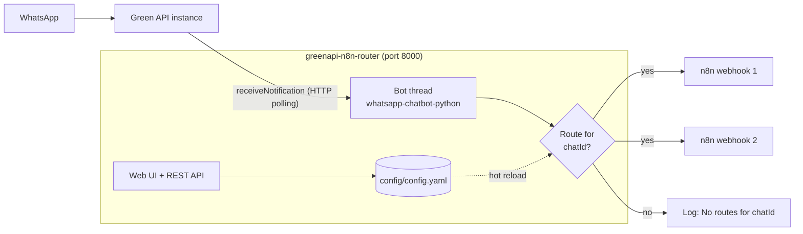

# Green API n8n Router

A lightweight, self-hosted relay that receives incoming WhatsApp messages from a [Green API](https://green-api.com/) instance and forwards each one to one or more [n8n](https://n8n.io/) webhook URLs, chosen by the chat ID the message came from. Routes and credentials are managed from a built-in Angular web interface, so one WhatsApp number can drive many separate n8n workflows (per contact or per group) without touching n8n's own webhook settings.


[](https://hub.docker.com/r/techblog/greenapi-n8n-router)
[](LICENSE)

---

## Table of Contents

- [Screenshots](#screenshots)
- [Features](#features)
- [How It Works](#how-it-works)
- [Requirements](#requirements)
- [Quick Start](#quick-start)
- [Configuration](#configuration)
- [Setting Up n8n](#setting-up-n8n)
- [Using the Web Interface](#using-the-web-interface)
- [API Reference](#api-reference)
- [Security Notes](#security-notes)
- [Troubleshooting](#troubleshooting)
- [Development](#development)
- [Project Structure](#project-structure)
- [Docker Release](#docker-release)
- [Contributing](#contributing)
- [License](#license)
- [Author](#author)

---

## Screenshots

### Routes — Dark Mode


### Routes — Light Mode


### Add Route Dialog


### Logs Tab


### Settings Tab


### About Tab


### Mobile


---

## Features

- **Route management**: map WhatsApp chat IDs (contacts `…@c.us` or groups `…@g.us`) to one or more n8n webhook URLs, each route with a friendly card name
- **Fan-out**: a single incoming message is forwarded to every URL configured for its chat
- **Contact search**: autocomplete from your Green API contact list when adding a route (type 3+ characters; results cached for 5 minutes)
- **URL validation**: only valid, non-duplicate `http://` / `https://` webhook URLs are accepted
- **Hot reload**: route changes, whether made in the UI or by editing `config.yaml` directly, apply immediately without a restart
- **Real-time logs**: live WebSocket log viewer showing message forwarding activity
- **Bot restart from the UI**: apply new credentials without taking the web interface down (see [Troubleshooting](#troubleshooting) for a caveat)
- **No inbound webhook needed**: messages are fetched from Green API by polling, so the router does not have to be reachable from the internet
- **Dark / light theme**: system-preference-aware toggle, persisted to `localStorage`
- **Responsive**: works on desktop, tablet, and mobile
- **REST API** with interactive Swagger docs at `/api/docs`

---

## How It Works


```mermaid
flowchart LR
    WA[WhatsApp] --> GA[Green API instance]
    GA -- "receiveNotification (HTTP polling)" --> BOT
    subgraph Router["greenapi-n8n-router (port 8000)"]
        BOT[Bot thread<br/>whatsapp-chatbot-python] --> MATCH{Route for<br/>chatId?}
        CFG[(config/config.yaml)] -.hot reload.-> MATCH
        UI[Web UI + REST API] --> CFG
    end
    MATCH -- yes --> N1[n8n webhook 1]
    MATCH -- yes --> N2[n8n webhook 2]
    MATCH -- no --> LOG[Log: No routes for chatId]
```

1. On startup the bot (built on [`whatsapp-chatbot-python`](https://github.com/green-api/whatsapp-chatbot-python)) connects to your Green API instance with the Instance ID and Token from `config.yaml` and starts **polling** Green API's HTTP API for notifications. If all message notifications are disabled on the instance, the library enables them automatically. It also clears any notifications already queued at startup.
2. For every **incoming message** (`incomingMessageReceived`), the router reads `senderData.chatId` and looks it up in the `routes` section of the config.
3. If a route exists, the full Green API notification is POSTed to each of the route's `target_urls` (one after another, 5-second timeout each, no retries). If no route matches, the message is dropped and a warning is logged. There is no default or catch-all route.
4. The web server (FastAPI + Uvicorn on port `8000`) serves the Angular UI, the REST API, and the `/ws/logs` log stream. Every change made through the UI is written back to `config.yaml`, and a file watcher reloads the routes in the running bot. If the credentials change, a new bot is started. The previous bot thread is not stopped, so a full container restart is recommended after changing credentials.

Outgoing messages (sent from your own phone or via the API) are **not** forwarded; only incoming messages are.

### Payload sent to n8n

Each webhook receives a `POST` with a JSON body that wraps the original Green API notification:

```json
{
  "chatId": "972501234567@c.us",
  "payload": {
    "typeWebhook": "incomingMessageReceived",
    "instanceData": { "idInstance": 1234567890, "wid": "…@c.us", "typeInstance": "whatsapp" },
    "timestamp": 1717580000,
    "idMessage": "…",
    "senderData": {
      "chatId": "972501234567@c.us",
      "sender": "972501234567@c.us",
      "senderName": "…"
    },
    "messageData": {
      "typeMessage": "textMessage",
      "textMessageData": { "textMessage": "Hello" }
    }
  }
}
```

`payload` is passed through unchanged, so its exact shape depends on the message type (text, image, location, and so on). See Green API's [incoming message notification docs](https://green-api.com/en/docs/api/receiving/notifications-format/incoming-message/) for every variant.

---

## Requirements

- A [Green API](https://green-api.com/) account with an authorized WhatsApp instance (Instance ID + API Token)
- An n8n instance with one or more **Webhook** trigger nodes, reachable from the router
- Docker (recommended), **or** Python 3.12 plus Node.js 20 to build the web UI from source

---

## Quick Start

### Docker Compose (recommended)

```yaml
services:
  greenapi-n8n-router:
    image: techblog/greenapi-n8n-router:latest
    container_name: greenapi-n8n-router
    volumes:
      - ./config:/app/config
    ports:
      - "8000:8000"
    restart: unless-stopped
```

```bash
docker compose up -d
```

Open `http://localhost:8000`, go to **Settings**, enter your Green API Instance ID and Token, and click **Save & Restart Bot**. Then add your routes in the **Routes** tab.

On first start the router creates `config/config.yaml` with empty credentials and one example route (`1234567890@c.us`). Delete or edit that route once you add your own.

> The `docker-compose.yaml` in this repository mounts a single file (`./app/config/config.yaml:/app/config/config.yaml`) instead of a directory. If you use it, create that file first. Otherwise Docker creates a directory with that name: the app still starts (with the built-in default config), but every save from the UI or API fails with HTTP 500. Mounting the whole `./config` directory, as shown above, avoids this.

### Docker run

```bash
docker run -d --name greenapi-n8n-router \
  -p 8000:8000 \
  -v "$(pwd)/config:/app/config" \
  --restart unless-stopped \
  techblog/greenapi-n8n-router:latest
```

### Native (from source)

The web UI must be built once before FastAPI can serve it:

```bash
git clone https://github.com/t0mer/greenapi-n8n-router.git
cd greenapi-n8n-router

# Build the Angular UI (output goes to app/static/dist/browser/)
cd web && npm ci && npm run build && cd ..

pip install -r requirements.txt
cd app && python app.py
```

When run natively, the config file is `app/config/config.yaml` (it is resolved relative to the working directory, `app/`).

---

## Configuration

### Config file (`config/config.yaml`)

Green API credentials and routes are stored in `config/config.yaml` (inside the container: `/app/config/config.yaml`; mount it as a volume so it survives restarts). You normally manage it through the web UI, but you can also edit it by hand. Changes are picked up automatically.

```yaml
green_api:
  instance_id: "1234567890"
  token: "your-token-here"
  # api_url: "https://7103.api.greenapi.com"   # optional, see below

routes:
  972501234567@c.us:
    name: "Support Team"
    target_urls:
      - https://n8n.example.com/webhook/support
      - https://n8n.example.com/webhook/backup
  120363025623@g.us:
    name: "Group Chat"
    target_urls:
      - https://n8n.example.com/webhook/group
```

| Key | Required | Default | Description |
|-----|----------|---------|-------------|
| `green_api.instance_id` | Yes | `""` | Green API instance ID. The bot does not start while this is empty. |
| `green_api.token` | Yes | `""` | Green API instance API token. The bot does not start while this is empty. |
| `green_api.api_url` | No | `https://api.green-api.com` | Green API base URL. Currently used **only** for the contact search in the UI; the message-polling bot always uses the default host. Omit the key to use the default (see [Troubleshooting](#troubleshooting)). Not editable in the UI. |
| `routes.<chatId>` | No | example route | One entry per WhatsApp chat. The key is the chat ID: `<phone>@c.us` for a contact, `<id>@g.us` for a group. |
| `routes.<chatId>.name` | No | the chat ID | Display name shown on the route card. |
| `routes.<chatId>.target_urls` | Yes | — | List of webhook URLs to POST each message to. |

#### Legacy route formats

Older configs that map a chat ID directly to a list of URLs (or a single URL string) are still accepted:

```yaml
routes:
  972501234567@c.us:
    - https://n8n.example.com/webhook/support
```

They are converted to the `name` / `target_urls` format when loaded (the name defaults to the chat ID), and saved in the new format the next time routes are changed from the UI or API.

### Environment variables

| Variable | Default | Description |
|----------|---------|-------------|
| `ROUTER_APP_VERSION` | `dev` | Version string reported by `/api/v1/version` and the About tab. Set automatically in the Docker image from the build's `VERSION` argument. |

> **Do not set `ROUTER_CONFIG_PATH`, `ROUTER_PORT` or `ROUTER_LOG_LEVEL`.** They are defined in `app/core/config.py`, but `ROUTER_CONFIG_PATH` is only honored by the REST API (the bot and the file watcher always use `config/config.yaml`, so changing it splits the UI and the bot onto different files), and `ROUTER_PORT` / `ROUTER_LOG_LEVEL` are not used at all.

The web server always listens on port **8000**. To expose it on another host port, change the port mapping (for example `-p 8080:8000`).

---

## Setting Up n8n

1. In n8n, add a **Webhook** trigger node to your workflow.
2. Set **HTTP Method** to `POST`.
3. Copy the webhook's **Production URL** (for example `https://n8n.example.com/webhook/support`). Use the **Test URL** (`/webhook-test/…`) only while testing in the editor.
4. Activate the workflow.
5. In the router UI, add a route for the chat ID and paste the URL.

Inside the workflow, the data is available under the webhook's body, for example:

- Chat ID: `{{ $json.body.chatId }}`
- Message text (text messages): `{{ $json.body.payload.messageData.textMessageData.textMessage }}`
- Sender name: `{{ $json.body.payload.senderData.senderName }}`

The router ignores the response body, but it waits for it: each POST has a 5-second timeout, and URLs are called one after another in the polling thread. A slow workflow therefore logs a timeout error and delays the remaining URLs and the next messages. Set the Webhook node's **Respond** option to **Immediately**.

---

## Using the Web Interface

The UI is served at `http://<host>:8000` and has four tabs:

- **Routes**: one card per chat ID showing its name and webhook URLs. Use the floating **+** button (or **Add Route** when the list is empty) to create a route. In the dialog, enter a card name, search your Green API contacts by name or number (3+ characters) or type a chat ID directly, and add one or more webhook URLs. Existing routes can be edited (the chat ID cannot be changed after creation) or deleted.
- **Logs**: a live stream of router activity over WebSocket (bot start/restart, config reloads, forwarded messages, errors). Logs are only shown while the page is open; use the clear button to empty the view.
- **Settings**: enter the Green API Instance ID and Token and click **Save & Restart Bot**. This writes the credentials to `config.yaml` and starts a new bot; the web server keeps running. The old bot is not stopped, so restart the container afterwards (see [Troubleshooting](#troubleshooting)). A warning banner is shown while credentials are missing.
- **About**: running version and project links.

The theme toggle in the toolbar switches between dark and light mode.

---

## API Reference

All REST endpoints are under `/api/v1`. Interactive Swagger docs are served at `http://localhost:8000/api/docs`.

| Method | Path | Description |
|--------|------|-------------|
| GET | `/api/v1/health` | Health check: `{"status": "healthy", "timestamp": …}` (used by the Docker `HEALTHCHECK`) |
| GET | `/api/v1/version` | Running version: `{"version": "2026.6.0"}` |
| GET | `/api/v1/routes` | List all routes: `{"routes": {"<chatId>": {"name": …, "target_urls": […]}}}` |
| POST | `/api/v1/routes` | Create a route. Body: `{"chat_id": "…", "name": "…", "target_urls": ["…"]}` (`name` optional). `400` if it already exists. |
| PUT | `/api/v1/routes/{chat_id}` | Update a route's URLs (and optionally name). Body: `{"target_urls": ["…"], "name": "…"}` |
| DELETE | `/api/v1/routes/{chat_id}` | Delete a route |
| PUT | `/api/v1/routes/{chat_id}/name` | Rename a route card. Body: `{"name": "…"}` |
| GET | `/api/v1/settings` | Get credentials (token is masked as `••••••••`) |
| POST | `/api/v1/settings` | Update credentials. Body: `{"instance_id": "…", "token": "…"}` |
| POST | `/api/v1/restart` | Start a new bot component (the web server stays up; the previous bot is not stopped, see [Troubleshooting](#troubleshooting)) |
| GET | `/api/v1/contacts` | List all Green API contacts: `{"contacts": [...], "cached": bool}` |
| GET | `/api/v1/contacts/search?q=…` | Search contacts by name or ID (min. 3 characters, max. 20 results) |
| WS | `/ws/logs` | Real-time log stream. Each message: `{"timestamp": "…", "level": "info\|success\|warning\|error", "message": "…"}` |

Chat IDs contain `@`, so URL-encode them in paths (`972501234567%40c.us`).

Example: add a route with `curl`:

```bash
curl -X POST http://localhost:8000/api/v1/routes \
  -H "Content-Type: application/json" \
  -d '{"chat_id": "972501234567@c.us", "name": "Support Team", "target_urls": ["https://n8n.example.com/webhook/support"]}'
```

---

## Security Notes

- **No authentication.** The web UI, the REST API and the `/ws/logs` stream have no login or token. Anyone who can reach port 8000 can view and change routes, replace the Green API credentials, and read logs. The server always binds to `0.0.0.0` inside the container, so limit exposure with the Docker port mapping (for example `-p 127.0.0.1:8000:8000`), run it on a trusted network, or put it behind a reverse proxy with authentication. Do not expose it directly to the internet.
- **No inbound exposure required.** The router polls Green API, so it only needs outbound HTTPS access to Green API and to your n8n webhooks.
- **Credentials at rest.** The Green API token is stored in plain text in `config/config.yaml`. Protect the mounted `config/` directory and never commit it (it is already in `.gitignore`). The API returns the token masked.
- **Webhook payloads** contain full message content and sender phone numbers. Prefer `https://` n8n webhook URLs.

---

## Troubleshooting

- **"⚠️ Bot not started - Instance ID and Token not configured"**: enter credentials in **Settings** and save.
- **"🚫 No routes for chatId: …"**: a message arrived from a chat with no route. Copy the chat ID from the log line and add a route for it.
- **Saving Settings breaks the connection**: the Settings form is pre-filled with the masked token (`••••••••`). Always re-enter the real token before clicking **Save & Restart Bot**, or the masked value is saved as the token.
- **Contact search returns nothing / errors**: check the credentials. If `api_url` is present in `config.yaml` but empty (`api_url: ""`), contact lookups fail; remove the key or set a full URL such as `https://7103.api.greenapi.com`.
- **No messages arrive at all**: the bot uses Green API's HTTP API polling (`receiveNotification`), which does not deliver notifications while a **webhook URL** is set on the instance in the Green API console. Clear that field and wait about a minute for the change to apply.
- **Duplicate forwards, or the old instance still being polled, after changing credentials**: saving Settings (and `POST /api/v1/restart`) starts a new bot but never stops the old bot thread, and a single save can start more than one extra bot. After changing credentials, restart the container (`docker restart greenapi-n8n-router`) or the native process.
- **Messages sent while the router was down are missing**: pending notifications are cleared when the bot starts, so messages received during downtime are not forwarded.
- **"✅ Forwarded to …" but the n8n workflow did not run**: the log reports that the request was sent, not that n8n accepted it (HTTP error responses are not checked). Make sure the workflow is **active** and you are using the Production URL.
- **"Angular app not built"** (HTTP 503) when running natively: build the UI with `cd web && npm ci && npm run build`.

---

## Development

### Backend

```bash
pip install -r requirements.txt
cd app
python app.py
# UI + API at http://localhost:8000, config at app/config/config.yaml
```

### Frontend

```bash
cd web
npm install
npm start
# Angular dev server at http://localhost:4200 (proxies /api and /ws to :8000)
```

### Build for production

```bash
cd web && npm run build
# Output written to app/static/dist/browser/
# FastAPI serves it automatically at http://localhost:8000
```

---

## Project Structure

```
greenapi-n8n-router/
├── app/
│   ├── api/v1/endpoints/   # FastAPI route handlers
│   ├── core/               # Settings (pydantic-settings)
│   ├── schemas/            # Pydantic v2 request/response models
│   ├── services/           # Business logic (RouteService, ContactsService)
│   ├── static/dist/        # Angular build output (gitignored)
│   ├── app.py              # Entrypoint: bot thread + Uvicorn thread + /ws/logs
│   ├── config_loader.py    # Load/create config.yaml, legacy route migration
│   ├── config_watcher.py   # Hot-reload on config.yaml changes (watchdog)
│   ├── restart_app.py      # Legacy restart helper (broken: posts to a non-existent /restart endpoint)
│   └── web_manager.py      # FastAPI app, SPA serving
├── web/                    # Angular 18 SPA source
│   └── src/app/
│       ├── routes/         # Routes tab + Add/Edit dialog
│       ├── logs/           # WebSocket log viewer
│       ├── settings/       # Credentials form
│       └── about/          # About tab
├── config/                 # Legacy SQLite log-table initialiser (not used by the app)
├── scripts/
│   └── next-version.sh     # YYYY.M.PATCH tag computation
└── Dockerfile              # Multi-stage: Node 20 → Python 3.12-slim
```

---

## Docker Release

Images are published to [techblog/greenapi-n8n-router](https://hub.docker.com/r/techblog/greenapi-n8n-router) on Docker Hub (`linux/amd64`, `linux/arm64`).

The release workflow (`.github/workflows/docker-image.yml`, run manually via `workflow_dispatch`) computes a `YYYY.M.PATCH` version automatically with `scripts/next-version.sh` (or takes one as input), creates and pushes that git tag, then builds the multi-platform image and pushes both `:latest` and the versioned tag. Note that the tag is pushed before the build, so a failed build still consumes a version number.

A second, optional workflow (`.github/workflows/publish-ghcr.yml`, manual) can publish to `ghcr.io/t0mer/greenapi-n8n-router` (adds `linux/arm/v7`), but no public GHCR image exists yet; use Docker Hub.

---

## Contributing

Issues and pull requests are welcome. Please open an [issue](https://github.com/t0mer/greenapi-n8n-router/issues) to report a bug or discuss a change before starting larger work.

---

## License

Apache License 2.0 — see [LICENSE](LICENSE).

## Author

**Tomer Klein** · [tomer.klein@gmail.com](mailto:tomer.klein@gmail.com)  
[GitHub](https://github.com/t0mer/greenapi-n8n-router) · [Report an issue](https://github.com/t0mer/greenapi-n8n-router/issues)
